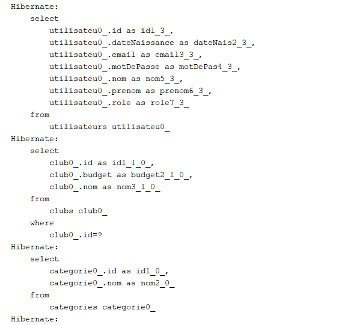
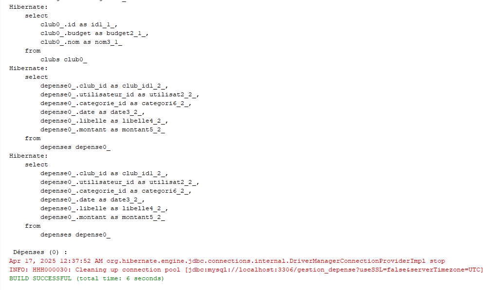
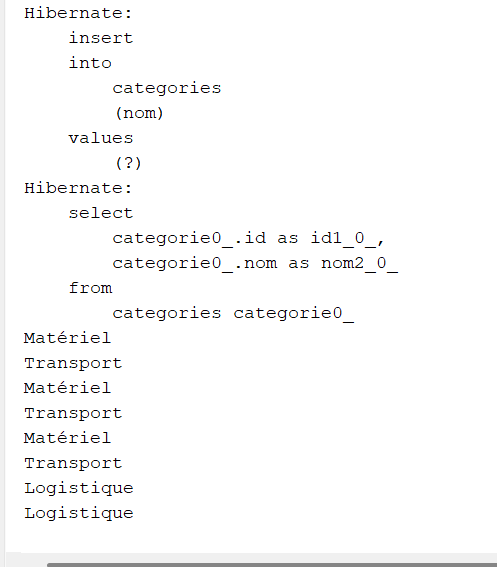
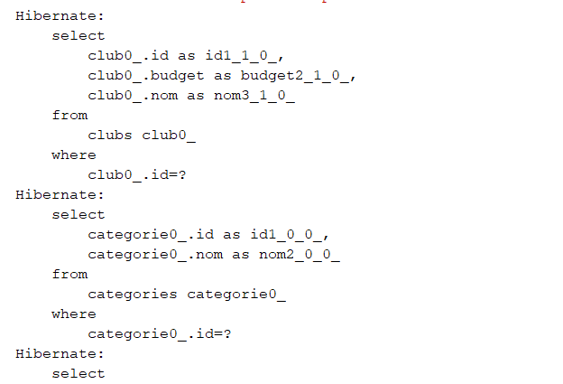
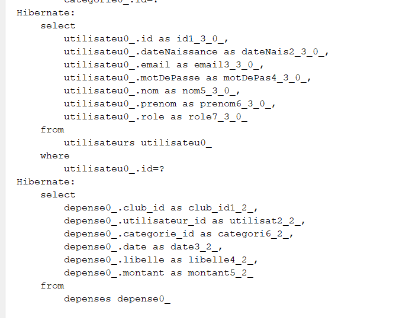
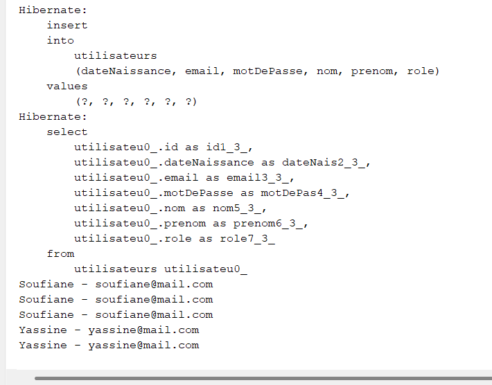

#  Gestion des Dépenses d’un Club

##  1. Contexte :
Les clubs scolaires ou associatifs disposent souvent d’un budget géré par un responsable. La gestion manuelle de ces dépenses (via papiers ou Excel) entraîne souvent un manque de clarté, de traçabilité, et des erreurs.

Ce projet a pour objectif de centraliser et simplifier la gestion financière d’un club via une application Java SE conviviale et performante.

##  2. Problématique :
- Difficulté à suivre les dépenses par catégorie ou activité.
- Absence de visualisation claire du solde disponible.
- Gestion manuelle propice aux erreurs humaines.
- Manque de statistiques financières pour le pilotage du club.

##  3. Objectifs :
- Gérer les **utilisateurs**, **catégories**, **clubs** et **dépenses**.
- Suivre en temps réel les dépenses par club.
- Générer des **graphiques statistiques** avec **JFreeChart**.
- Créer une base de données relationnelle avec **Hibernate/MySQL**.
- Utiliser des interfaces graphiques Java Swing.

##  4. Technologies utilisées :

###  Backend & Desktop :
- **Java SE** – Langage principal du projet.
- **Swing** – Création d’interfaces utilisateurs (JInternalFrame, JTable, etc.).
- **JDBC + Hibernate** – Connexion et gestion de la base de données.
- **JFreeChart** – Génération de graphiques circulaires et en barres.

###  Base de données :
- **MySQL** – Pour stocker les entités Club, Dépense, Utilisateur, Catégorie.
- **Hibernate.cfg.xml** – Configuration de la persistance ORM.

---

##  5. Architecture du projet :

- `entities` : contient les classes Java mappées (`Club`, `Utilisateur`, `Categorie`, `Depense`...).
- `dao` : contient les classes DAO responsables des opérations CRUD.
- `util` : gestion de la configuration Hibernate.
- `test` : classe `Test.java` qui initialise et vérifie les fonctionnalités.

---

##  6. Diagramme de classe UML :

---

##  7. Modèle conceptuel de la base :

---

##  8. Résultat des tests dans la console :

